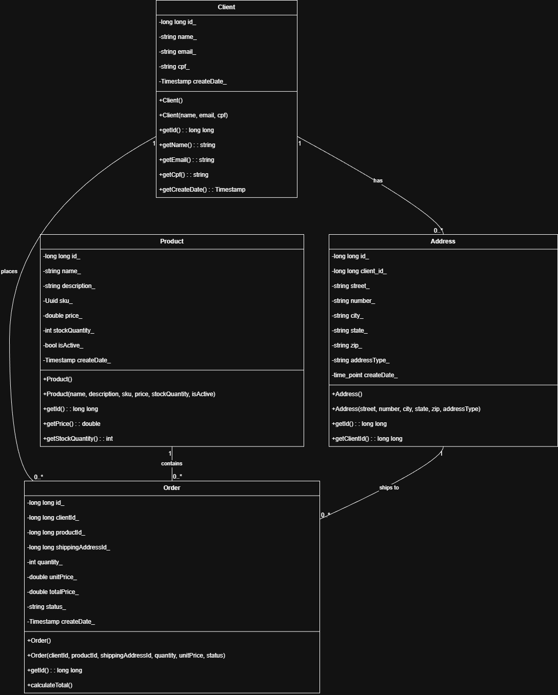

# e-cocin

  <strong>Integrantes:</strong>
  
Kauã Wallace Silva Melo

  
KLismman Luan Cabral Silva

  
Luiz Ribeiro da Silva Neto

  
Raphael Alves da Silva

 

Este projeto foi desenvolvido em **C++** utilizando o framework **Oat++** e segue uma arquitetura limpa e modular (Controladores, Serviços e Repositórios) para gerenciar os dados.

---

## Principais Funcionalidades

O sistema implementa todas as operações essenciais de CRUD (Criar, Ler, Atualizar, Deletar) para as seguintes entidades:

* **Gerenciamento de Clientes**: Cadastro, listagem e busca de clientes por ID ou CPF.
* **Gerenciamento de Produtos**: Cadastro, listagem, atualização e busca de produtos por ID ou SKU.
* **Gerenciamento de Endereços**: Permite que clientes cadastrem múltiplos endereços associados às suas contas.
* **Criação e Consulta de Pedidos**: Sistema para registrar novos pedidos, ligando um cliente, um produto e um endereço de entrega.

---

## Diagrama da Arquitetura

Este diagrama ilustra a arquitetura central do domínio do sistema e-cocin, mostrando as principais entidades de negócio e como elas se relacionam.

#### Entidades Principais

* **Client (Cliente)**: É a entidade central do sistema. Representa o utilizador que fará compras. Possui atributos essenciais como `name`, `email` e `cpf` (que funciona como um identificador de negócio único).
* **Address (Endereço)**: Representa uma localização física associada a um cliente. Contém informações como `street`, `city`, `state`, `zip`, e um `addressType` (ex: "residential", "commercial").
* **Product (Produto)**: Representa um item disponível para venda no e-commerce. Possui atributos como `name`, `description`, `price` (preço) e `stockQuantity` (quantidade em stock).
* **Order (Pedido)**: É a entidade transacional que une todas as outras. Representa a ação de compra de um produto por um cliente para ser entregue num endereço.

#### Relacionamentos (Associações)

1.  **Client 1 --- 1..* Address** (`has / tem`)
    * Um `Client` (Cliente) pode ter (`has`) um ou mais `Address` (Endereços) registados.
    * Cada `Address` pertence a exatamente um `Client`. Esta ligação é implementada através do campo `client_id_` na entidade `Address`, que armazena o ID do cliente.

2.  **Client 1 --- 0..* Order** (`places / faz`)
    * Um `Client` pode fazer (`places`) zero ou mais `Order` (Pedidos) ao longo do tempo.
    * Cada `Order` está associado a exatamente um `Client`. Esta ligação é implementada pelo campo `clientId_` na entidade `Order`.

3.  **Order 1..* --- 1 Product** (`contains / contém`)
    * Um `Order` contém exatamente um tipo de `Product`. A quantidade desse produto é definida pelo atributo `quantity_` dentro do próprio pedido.
    * Um `Product` pode estar contido em um ou mais `Order` (vários clientes podem comprar o mesmo produto).
    * Esta ligação é implementada pelo campo `productId_` na entidade `Order`.

4.  **Order 0..* --- 1 Address** (`ships to / é enviado para`)
    * Um `Order` é enviado para (`ships to`) exatamente um `Address`.
    * Um `Address` pode receber zero ou mais `Order` (o cliente pode reutilizar o mesmo endereço para várias compras).
    * Esta ligação é implementada pelo campo `shippingAddressId_` na entidade `Order`, que aponta para o ID do endereço de entrega selecionado. A lógica de negócio para selecionar o endereço correto (ex: pelo `addressType`) é gerida pela camada de serviço.

---

## Vídeo de Apresentação

Veja abaixo uma breve demonstração do projeto e da API em funcionamento.

<iframe width="755" height="315" src="https://www.youtube.com/embed/89aaFJt6pKU?si=VmizOikhuo2_6orl" title="YouTube video player" frameborder="0" allow="accelerometer; autoplay; clipboard-write; encrypted-media; gyroscope; picture-in-picture; web-share" referrerpolicy="strict-origin-when-cross-origin" allowfullscreen></iframe>

---

## Links Úteis

* **[Acessar o Relatório Completo](Documentação_POO.docx)**: Clique aqui para ver a documentação detalhada sobre a arquitetura, padrões de projeto (OOP) e a divisão de trabalho.

* **[Ver o Código-Fonte no GitHub](https://github.com/Raphael-Alves-S/e-cocin)**: Clique para explorar o repositório, o código-fonte completo e as instruções de build.

